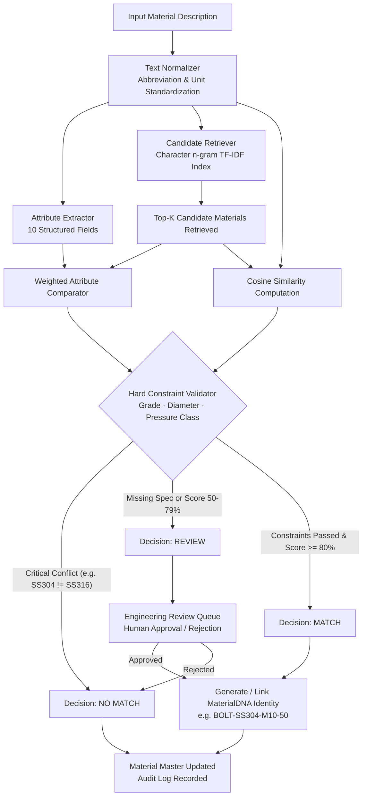

```markdown
<div align="center">

# MaterialDNA AI

**A similarity- and rule-based material standardization engine for harmonizing inconsistent material codes and descriptions across CPSEs.**

[](https://www.python.org/)
[](https://fastapi.tiangolo.com/)
[](https://react.dev/)
[](https://www.typescriptlang.org/)
[](https://vitejs.dev/)
[](LICENSE)

[Repository](https://github.com/jaishrivijayakumar/MaterialDNA-AI) | [At a Glance](#at-a-glance) | [Problem Statement](#problem-statement) | [Workflow](#system-workflow) | [Dataset](#dataset) | [Quickstart](#getting-started)

</div>

---

## At a Glance

| Component / Metric | Specification in Implementation |
|---|---|
| **Architecture** | FastAPI REST Backend + React 19 Single-Page App (TypeScript, Vite) |
| **Matching Technique** | Sub-word Character n-gram TF-IDF + Weighted Comparison + Hard Constraints |
| **Pipeline Stages** | 7 traceable stages (Input, Normalize, Extract, Retrieve, Compare, Validate, Decide) |
| **Extracted Attributes** | 10 technical fields (Type, Grade, Diameter, Length, Material, Standard, Rating, etc.) |
| **Curated Catalog** | 73 demonstration records spanning NTPC, BHEL, and ONGC item masters |
| **Evaluation Suite** | 17 pre-seeded evaluation cases (true matches, hard negatives, review triggers) |
| **Harmonized Clusters** | 6 pre-built MaterialDNA identities linking 19 CPSE-specific local codes |
| **Review Queue** | 5 pre-seeded engineering review cases for missing specifications |
| **Database Layer** | Persistent SQLite storage (`materialdna.db`) via SQLAlchemy 2.0 (PostgreSQL-ready) |

---

## Project Overview

In large public sector organizations, separate operating units and enterprises maintain independent material masters. The exact same physical component is frequently entered under varying descriptions, abbreviations, units, and item numbers.

**MaterialDNA AI** addresses this challenge by:
1. **Normalizing** noisy, unstructured material descriptions into a canonical text format.
2. **Extracting** structured technical parameters (dimensions, metallurgy, standards, ratings).
3. **Retrieving** candidate matches across enterprises using sub-word TF-IDF vector similarity.
4. **Validating** critical engineering constraints so incompatible materials (such as SS304 vs. SS316) are rejected despite high text similarity.
5. **Routing** ambiguous records with missing attributes to a human-in-the-loop review queue.
6. **Assigning** verified equivalent items to a deterministic canonical code (e.g., `BOLT-SS304-M10-50`).

---

## Problem Statement

Industrial components across enterprises such as NTPC, BHEL, and ONGC exhibit distinct recording conventions for physically interchangeable items:

| Enterprise | Local Material Code | Description in Catalog | Technical Challenge |
|---|---|---|---|
| **NTPC** | `NTPC-FST-10234` | `HEX BOLT M10 X 50 SS304` | Abbreviated specifications (`HEX`, `SS304`) |
| **BHEL** | `BH-FAST-20456` | `HEXAGONAL BOLT 10MM X 50MM STAINLESS STEEL 304` | Spelled-out terms (`HEXAGONAL`, `STAINLESS STEEL 304`) |
| **ONGC** | `ONGC-BLT-8831` | `SS304 HEX BOLT M10 X 50` | Inverted word order with leading metallurgy |
| **BHEL (Conflict)** | `BH-FAST-20457` | `HEX BOLT M10 X 50 SS316` | **False Match Risk**: 90%+ text overlap, but incompatible metallurgy |
| **ONGC (Incomplete)** | `ONGC-BLT-8832` | `HEX BOLT M10 X 50 SS` | **Missing Attribute**: Omits grade; cannot be auto-merged safely |

Standard lexical or word-level similarity tools often fail on alphanumeric formatting differences or, worse, falsely match components with conflicting metallurgical grades. MaterialDNA AI enforces domain-specific rules to ensure technical equivalence before any records are merged.

---

## What We Actually Built

The repository contains an end-to-end, working full-stack implementation across six functional layers:

### 1. Data Layer
- **Demonstration Dataset**: 73 curated records spanning NTPC, BHEL, and ONGC across 6 categories.
- **Verification Records**: 17 pre-seeded match results, 5 review items, 6 standardized identities, and 15 audit log entries.
- **File Upload Parsing**: Dynamic CSV and Excel (`.xlsx`, `.xls`) ingestion with automatic schema and error detection.

### 2. Processing Engine
- **Text Normalizer (`backend/engine/normalizer.py`)**: 10-step regex transformation pipeline:
  - Standardizes unicode punctuation and separators.
  - Normalizes dimension delimiters (e.g., `10MM X 50MM`).
  - Binds units to digits (`10 MM` to `10MM`) and normalizes metric threads (`M 10` to `M10`).
  - Expands 63 technical abbreviations (`HEX`, `SS`, `CS`, `HTS`, `VLV`, `BRG`, `CL`, `SCH`).
  - Removes 15 low-information filler words (`FOR`, `USE`, `ITEM`, `MAKE`, `SUPPLY`).
- **Attribute Extractor (`backend/engine/extractor.py`)**: Regular expression patterns extracting 10 distinct technical dimensions from text.
- **Attribute Comparator (`backend/engine/comparator.py`)**: Weighted comparison logic that resolves equivalences (e.g., `M10` == `10MM`, `SS304` == `STAINLESS STEEL 304`).

### 3. AI / Matching Engine
- **Candidate Retriever (`backend/engine/retriever.py`)**: Sub-word character n-gram TF-IDF vectorizer + cosine similarity for fast candidate selection.
- **Hard Constraint Validator (`backend/engine/constraints.py`)**: Domain validator checking critical attributes (grade, diameter, pressure class, base materials). Critical mismatches trigger an immediate `no_match` override.
- **Confidence Scorer (`backend/engine/scorer.py`)**: Combines 40% semantic similarity and 60% attribute match score with missing-specification penalties.

### 4. Backend Service
FastAPI application (`backend/main.py`) providing 15+ REST endpoints across 7 modular routers:

<details>
<summary><strong>View Backend API Route Inventory</strong></summary>

| Router Prefix | Method | Endpoint | Description |
|---|---|---|---|
| `/api/materials` | GET | `/` | Query materials with pagination, search, and CPSE/category/status filters |
| `/api/materials` | GET | `/{material_id}` | Retrieve full details and extracted attributes for a material |
| `/api/materials` | GET | `/categories` | Distinct list of material categories |
| `/api/materials` | GET | `/cpses` | Distinct list of source CPSE enterprises |
| `/api/materials` | POST | `/upload/preview`| Validate and preview uploaded CSV or Excel spreadsheets |
| `/api/materials` | POST | `/upload` | Ingest validated spreadsheet records and trigger retriever re-index |
| `/api` | POST | `/match` | Run 7-stage matching pipeline on a single description or between pairs |
| `/api` | GET | `/matches/{match_id}`| Retrieve stored match evaluation details |
| `/api/reviews` | GET | `/` | Query review queue items filtered by status (`pending`, `approved`, `rejected`) |
| `/api/reviews` | POST | `/{id}/approve` | Approve a review item, mark material matched, and write audit entry |
| `/api/reviews` | POST | `/{id}/reject` | Reject a review item, mark material no_match, and write audit entry |
| `/api/material-identities` | GET | `/` | List all harmonized identities with linked CPSE codes |
| `/api/material-identities` | GET | `/{id}` | Retrieve single identity details |
| `/api/material-identities` | POST | `/` | Manually cluster materials under a new standardized identity |
| `/api/analytics` | GET | `/` | Aggregate counts, CPSE breakdowns, decision distributions, insights |
| `/api/audit` | GET | `/` | Query audit trail entries with action and limit filters |

</details>

### 5. Frontend Application
React 19 single-page application built with TypeScript, Vite, Recharts, and Lucide icons:

| Screen | Route | Description |
|---|---|---|
| **Welcome** | `/` | Platform entry view with physical component SVG diagrams and CPSE tag strip |
| **Overview** | `/overview` | Operational dashboard with harmonization distribution bar, workflow tracker, and metrics |
| **AI Matching** | `/matching` | Interactive matching console with 4 scenario presets, 7-stage animated pipeline, and attribute comparison tables |
| **Review Queue** | `/reviews` | Human-in-the-loop triage queue with technical diff drawers, approval/rejection actions, and engineer notes |
| **MaterialDNA** | `/identities` | Directory of standardized identities featuring an SVG convergence diagram linking multiple CPSE codes |
| **Material Master** | `/materials` | Searchable catalog table with debounced search, filters, pagination, and slide-out detail drawers |
| **Data Import** | `/import` | File upload workspace with drag-and-drop ingestion, column detection, and preview tables |
| **Analytics** | `/analytics` | Reporting dashboard with category distribution bar charts and decision donut charts |
| **Audit Trail** | `/audit` | Traceable event ledger tracking AI evaluations and engineer actions with timestamps |

### 6. Database Layer
- SQLAlchemy 2.0 ORM with 5 tables: `materials`, `match_results`, `reviews`, `material_identities`, and `audit_logs`.
- Active local SQLite database (`backend/data/materialdna.db`).
- Configurable to PostgreSQL by setting the `DATABASE_URL` environment variable.

---

## Dataset

The platform is evaluated on a curated demonstration dataset modeled after real CPSE procurement specifications:

| Dataset / Source | Purpose | Records | Key Fields |
|---|---|---:|---|
| **Curated CPSE Master (`seed.py`)** | Seed catalog modeling real items from NTPC, BHEL, and ONGC | 73 | `cpse`, `original_code`, `original_description`, `category` |
| **Pre-configured Match Evaluations** | Test cases demonstrating true matches, hard negatives, and reviews | 17 | `source_material_id`, `candidate_material_id`, `decision`, `confidence` |
| **Pre-seeded Reviews** | Engineering review cases triggered by missing specifications | 5 | `source_material_id`, `candidate_material_id`, `reason`, `status` |
| **Pre-seeded MaterialDNA Identities** | Demonstration clusters linking equivalent CPSE records | 6 | `standardized_code`, `category`, `attributes`, `material_ids` |
| **Dynamic Ingestion (CSV / Excel)** | User-provided material records uploaded through the import interface | Variable | `original_description` (required), `cpse`, `original_code`, `category` |

### Verified Dataset Facts
- **Origins**: The 73 seed records are synthetic / manually curated records modeling authentic tender schedules from NTPC Limited, BHEL, and ONGC across 6 engineering categories:
  - Fasteners (Hex Bolts, Stud Bolts, Nuts, Washers)
  - Valves (Gate, Ball, Globe, Check, Butterfly)
  - Bearings (Deep Groove Ball, Taper Roller)
  - Pipes & Fittings (Seamless Pipes, Elbows, Reducers, Flanges)
  - Gaskets & Seals (Spiral Wound, O-Rings, CAF)
  - Electrical (Power Cables, Control Cables, Cable Glands, Circuit Breakers)
- **Deliberate Edge Cases**: The dataset explicitly includes near-duplicate hard negatives (e.g., `HEX BOLT M10 X 50 SS304` vs. `HEX BOLT M10 X 50 SS316`) and incomplete specifications (e.g., `HEX BOLT M10 X 50 SS`) to test constraint rejection and review routing.
- **External Standards**: GeM and UNSPSC categorization hierarchies are **not** present in the current codebase.

---

## Material DNA

Material DNA is the structured representation of a component's physical and technical specifications, parsed out of unstructured text. The implementation extracts and uses 10 distinct attributes:

| Attribute | Example Value | Role in Matching | Critical Constraint? |
|---|---|---|:---:|
| `material_type` | Hex Bolt, Gate Valve, Pipe | Component category identification | No (20% weight) |
| `grade` | SS304, SS316, 10.9, 8.8, WCB | Metallurgical grade or property class | **Yes (Hard Override)** |
| `diameter` | M10, M20, 25MM, 2", 50NB | Primary diameter or thread designation | **Yes (Hard Override)** |
| `length` | 50MM, 65MM, 120MM | Nominal fastener or component length | No (10% weight) |
| `material` | Stainless Steel, Carbon Steel, Brass | Base material classification | **Yes (Base Check)** |
| `standard` | IS 1364, ASTM A193, DIN 933 | National or international standard | No (5% weight) |
| `pressure_class` | 150#, 300LB, PN16, Class 150 | Pressure rating for valves and fittings | **Yes (Hard Override)** |
| `schedule` | SCH 40, SCH 80, SCH 40S | Pipe wall thickness schedule | No (3% weight) |
| `nominal_bore` | NB 25, 50NB | Nominal pipe bore dimension | No (2% weight) |
| `uom` | EA, KG, MTR, SET | Unit of measurement | Reference |

### Attribute Transformation Pipeline

```text
[Raw Input from BHEL]
"HEXAGONAL BOLT 10MM X 50MM STAINLESS STEEL 304"
                      │
                      ▼ 01. Text Normalization
"HEXAGONAL BOLT 10MM X 50MM STAINLESS STEEL 304"
(Standardized dimensions, bound units, canonical casing)
                      │
                      ▼ 02. Regex Attribute Extraction
{
  "material_type": "Hex Bolt",
  "grade"        : "SS304",
  "diameter"     : "M10",
  "length"       : "50MM",
  "material"     : "Stainless Steel"
}
                      │
                      ▼ 03. Deterministic Code Synthesis
[TYPE] - [GRADE] - [DIAMETER] - [LENGTH]
Standardized MaterialDNA: "BOLT-SS304-M10-50"
```

---

## System Workflow



---

## AI / ML / Matching Approach

The platform uses a **hybrid statistical and rule-based matching system**. It does **NOT** use a trained deep learning neural network or a large language model.

### 1. Candidate Retrieval (Sub-word TF-IDF)
Candidate retrieval runs via `scikit-learn`'s `TfidfVectorizer` paired with cosine similarity:
- `analyzer="char_wb"`: Operates on character n-grams within word boundaries to handle joined alphanumeric strings (`M10X50` vs. `M10 X 50`).
- `ngram_range=(2, 4)`: Captures fine-grained prefixes, sizes, and sub-tokens.
- `max_features=10000`, `sublinear_tf=True`, `strip_accents="unicode"`.

### 2. Attribute Extraction & Weighted Comparison
Regex patterns extract 10 technical fields. The comparator scores candidates across weighted attributes:
- `grade`: **25%**
- `material_type`: **20%**
- `diameter`: **20%**
- `length`: **10%**
- `material`: **10%**
- `standard`: **5%**
- `pressure_class`: **5%**
- `schedule`: **3%**
- `nominal_bore`: **2%**

Equivalence logic resolves common format mismatches (e.g., `M10` == `10MM`, `SS304` == `STAINLESS STEEL 304`).

### 3. Hard Constraint Validation
- **Critical Attributes**: `grade`, `diameter`, `pressure_class`.
- **Incompatible Base Materials**: Stainless Steel vs. Carbon Steel, Stainless Steel vs. Mild Steel, Carbon Steel vs. Brass, etc.
- **Override Rule**: A critical attribute mismatch overrides high semantic similarity, forcing `passed = False` and `decision_override = "no_match"`. Missing critical attributes force `decision_override = "review"`.

### 4. Confidence Scoring Formula & Thresholds
- **Formula**: `Weighted Confidence = (Cosine Similarity * 100 * 0.4) + (Attribute Score * 0.6)`.
- **Penalties**: -10% per missing critical attribute, -5% per warning.
- **Constraint Failure Override**: If a hard constraint fails, confidence is capped at `min(semantic_similarity * 30, 40)`.

| Adjusted Confidence | Constraint Condition | Decision | System Action |
|---|---|---|---|
| **>= 80%** | All constraints pass | **MATCH** | Automatically clusters under MaterialDNA code |
| **50% to 79%** | Or missing critical attribute | **REVIEW** | Sent to Engineering Review Queue |
| **< 50%** | Or hard constraint failure | **NO MATCH** | Rejected as incompatible component |

*Note on Evaluation*: The repository does not contain formal precision/recall benchmark metrics on a separated test split. Verification is performed using the 17 seeded test cases and runtime scenario presets.

---

## Key Features

- **7-Stage Traceable Pipeline**: Executes text normalization, attribute extraction, candidate retrieval, similarity scoring, attribute comparison, constraint validation, and confidence scoring.
- **Hard Engineering Constraint Checking**: Enforces metallurgical and dimensional incompatibilities to prevent false-positive matches.
- **Deterministic 10-Field Attribute Extraction**: Parses component type, grade, diameter, length, standard, pressure rating, and schedule from unstructured text.
- **Human-in-the-Loop Review Queue**: Routes ambiguous or missing-specification matches to engineers with technical diffs and notes.
- **MaterialDNA Canonical Code Synthesis**: Generates structured, readable codes (e.g., `BOLT-SS304-M10-50`) to cluster equivalent items.
- **Scenario Testing Presets**: Includes interactive UI presets demonstrating equivalent fasteners, metallurgical conflicts, missing specifications, and dense standard formats.
- **Batch Spreadsheet Data Import**: Drag-and-drop CSV and Excel file ingestion with column validation, preview generation, and automatic retriever re-indexing.
- **Traceable Governance Audit Trail**: Chronological event ledger recording every analysis, review decision, actor type (AI vs. Human), and timestamp.

---

## Technical Architecture

```text
+------------------------------------------------------------------------+
|                          PRESENTATION LAYER                            |
|             React 19 + TypeScript 6.0 + Vite 8.3 + Vanilla CSS         |
|                                                                        |
|  [Welcome]  [Overview]  [AI Matching]  [Review Queue]  [MaterialDNA]   |
|  [Material Master]  [Data Import]  [Analytics]  [Audit Trail]          |
+------------------------------------------------------------------------+
                                   │
                                   ▼ HTTP REST Calls (/api/*)
+------------------------------------------------------------------------+
|                          API ROUTING LAYER                             |
|                             FastAPI Server                             |
|                                                                        |
|  /materials  /match  /reviews  /material-identities  /analytics        |
|  /audit      /upload                                                   |
+------------------------------------------------------------------------+
                                   │
                                   ▼
+------------------------------------------------------------------------+
|                          PROCESSING ENGINE                             |
|                                                                        |
|  normalizer.py   -> Text canonicalization & abbreviation expansion    |
|  extractor.py    -> 10-attribute regex pattern matching                |
|  retriever.py    -> Character n-gram TF-IDF index + Cosine Similarity  |
|  comparator.py   -> Weighted attribute equivalence comparison          |
|  constraints.py  -> Hard engineering compatibility rules               |
|  scorer.py       -> Confidence calculation & penalty deductions        |
|  pipeline.py     -> 7-stage orchestrator & canonical code generator    |
+------------------------------------------------------------------------+
                                   │
                                   ▼
+------------------------------------------------------------------------+
|                          DATA STORAGE LAYER                            |
|                         SQLAlchemy 2.0 ORM                             |
|                                                                        |
|  SQLite (backend/data/materialdna.db)  |  PostgreSQL (Supported)       |
|  Tables: materials, match_results, reviews, material_identities, audit |
+------------------------------------------------------------------------+
```

---

## Tech Stack

| Category | Technology | Usage in Repository |
|---|---|---|
| **Backend Framework** | FastAPI (>=0.100.0) | REST API routing, request validation, and OpenAPI documentation |
| **Web Server** | Uvicorn (>=0.23.0) | ASGI web server |
| **Backend Language** | Python (>=3.10) | Processing engine, string parsing, and matching logic |
| **Machine Learning / NLP** | Scikit-learn (>=1.3.0) | Sub-word TF-IDF character vectorizer and cosine similarity |
| **Data Processing** | NumPy (>=1.26.0), Pandas (>=2.1.0) | Array manipulations, tabular calculations, CSV ingestion |
| **Spreadsheets** | OpenPyXL (>=3.1.0) | Microsoft Excel (`.xlsx`, `.xls`) ingestion |
| **Database & ORM** | SQLAlchemy (>=2.0.0), SQLite | Relational schema, session management, default SQLite DB |
| **Validation** | Pydantic (>=2.0.0) | Request/response schemas and serialization |
| **Frontend Framework** | React 19.2, TypeScript 6.0 | Single-page application UI |
| **Build Tool** | Vite 8.3 | Development server and production bundling |
| **Charts** | Recharts 3.10 | Bar and donut charts on the Analytics page |
| **Icons** | Lucide React 1.46 | Interface iconography |
| **Styling** | Vanilla CSS (`index.css`) | Custom design system using CSS custom properties |

---

## Project Structure

```text
MaterialDNA-AI/
├── backend/
│   ├── data/
│   │   └── materialdna.db           # SQLite database with pre-seeded records
│   ├── engine/
│   │   ├── comparator.py            # Weighted attribute comparison
│   │   ├── constraints.py           # Hard engineering constraint checks
│   │   ├── extractor.py             # 10-attribute regex extractor
│   │   ├── normalizer.py            # Normalization & abbreviation map
│   │   ├── pipeline.py              # Matching orchestrator & code generator
│   │   ├── retriever.py             # TF-IDF candidate retriever
│   │   └── scorer.py                # Confidence scoring & explanations
│   ├── routers/
│   │   ├── analytics.py             # KPI metrics & aggregations
│   │   ├── audit.py                 # Audit trail logging
│   │   ├── identities.py            # MaterialDNA identity endpoints
│   │   ├── matching.py              # Matching endpoints
│   │   ├── materials.py             # Material Master CRUD
│   │   ├── reviews.py               # Review queue actions
│   │   └── upload.py                # CSV/Excel upload handling
│   ├── database.py                  # Database connection setup
│   ├── main.py                      # FastAPI entry point & startup indexer
│   ├── models.py                    # SQLAlchemy ORM definitions
│   ├── requirements.txt             # Python dependencies
│   ├── schemas.py                   # Pydantic schema models
│   ├── seed.py                      # Seed data script (73 records)
│   └── vercel.json                  # Serverless deployment configuration
├── frontend/
│   ├── src/
│   │   ├── api/
│   │   │   └── client.ts            # Typed frontend API client
│   │   ├── pages/
│   │   │   ├── AIMatching.tsx       # Matching console & presets
│   │   │   ├── Analytics.tsx        # Charts & statistics
│   │   │   ├── AuditTrail.tsx       # Audit log explorer
│   │   │   ├── Dashboard.tsx        # Overview dashboard
│   │   │   ├── DataImport.tsx       # File upload page
│   │   │   ├── MaterialDNA.tsx      # Standardized identities catalog
│   │   │   ├── MaterialMaster.tsx   # Material master browser
│   │   │   ├── ReviewQueue.tsx      # Human review interface
│   │   │   └── Welcome.tsx          # Landing view with animations
│   │   ├── App.tsx                  # App shell & routing
│   │   ├── index.css                # Application stylesheet
│   │   └── main.tsx                 # React entry point
│   ├── package.json                 # Node dependencies
│   └── vite.config.ts               # Vite configuration
└── README.md
```

---

## Getting Started

### Prerequisites
- Python 3.10 or higher
- Node.js 18 or higher with npm

### 1. Start the Backend Service
```bash
# Navigate to backend
cd backend

# Create and activate a virtual environment
python -m venv venv
# On Windows:
venv\Scripts\activate
# On Linux/macOS:
source venv/bin/activate

# Install dependencies
pip install -r requirements.txt

# Start FastAPI server
uvicorn main:app --reload --host 0.0.0.0 --port 8000
```
On startup, FastAPI creates the database tables, seeds demonstration records if empty, and builds the TF-IDF search index. Interactive API documentation is available at `http://localhost:8000/docs`.

### 2. Start the Frontend Application
```bash
# Navigate to frontend (in a separate terminal)
cd frontend

# Install dependencies
npm install

# Start Vite development server
npm run dev
```
The frontend application will be accessible at `http://localhost:5173`.

---

## Current Limitations

- **Regex-Bound Extraction**: Attribute extraction relies on defined regex patterns. Unconventional description formats or non-standard metric phrasing not covered by the patterns will fail to extract into structured fields.
- **Language**: Only English-language industrial descriptions are supported.
- **Heuristic Weighting**: The 40/60 semantic-to-attribute weighting ratio and individual attribute weights are domain heuristics, not learned parameters from regression or machine learning models.
- **Local Storage Default**: The default configuration runs on a single SQLite file (`materialdna.db`), which requires switching to PostgreSQL for high-concurrency production deployments.
- **No External Taxonomy Integration**: GeM and UNSPSC categorization hierarchies are not currently mapped in the data models.

---

## Future Scope

- **Domain-Specific Embeddings**: Experimenting with domain-adapted sentence transformers (e.g., fine-tuned on industrial equipment manuals) to supplement character n-gram TF-IDF.
- **Automated Taxonomy Alignment**: Adding automated mapping between generated MaterialDNA codes and official GeM / UNSPSC categories.
- **ERP Adapters**: Building data connector scripts for SAP MM (Material Management) tables (`MARA`, `MAKT`) to import real enterprise dumps.
- **Distributed Vector Search**: Migrating the in-memory retriever index to a vector database (e.g., Qdrant or PostgreSQL `pgvector`) for catalogs with over 100,000 SKUs.

---

## Authors & Maintainers

- **Project**: MaterialDNA AI
- **Repository Maintainer**: [Jaishri Vijayakumar](https://github.com/jaishrivijayakumar)
- **Team / Organization**: CodeUnify
```
