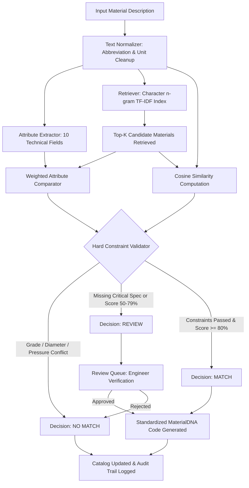

Searched for "UNSPSC"
Searched for "GeM"

```markdown
# MaterialDNA AI

> A similarity- and rule-based material standardization engine for harmonizing inconsistent material codes and descriptions across CPSEs.

[](https://www.python.org/)
[](https://fastapi.tiangolo.com/)
[](https://react.dev/)
[](https://www.typescriptlang.org/)
[](https://vitejs.dev/)
[](https://github.com/jaishrivijayakumar/MaterialDNA-AI)

MaterialDNA AI is a web application that ingests fragmented industrial material descriptions, extracts structured technical attributes, checks hard engineering constraints, and clusters equivalent materials under unified canonical identities. Built for Central Public Sector Enterprise (CPSE) procurement scenarios, it combines sub-word TF-IDF candidate retrieval with deterministic attribute validation to prevent false equivalences.

- **GitHub Repository**: [https://github.com/jaishrivijayakumar/MaterialDNA-AI](https://github.com/jaishrivijayakumar/MaterialDNA-AI)
- **Live Demo / Deployment**: Configured for local execution and serverless backend deployment via `backend/vercel.json`.

---

## Project Overview

In large public sector organizations, different operating units and enterprises maintain independent material masters. The same physical component is frequently entered under varying descriptions, abbreviations, and item numbers.

MaterialDNA AI addresses this problem by:
1. Normalizing noisy, unstructured material descriptions into canonical text.
2. Parsing technical specifications (dimensions, metallurgy, ratings, standards) into structured parameters.
3. Retrieving potential matches using character n-gram TF-IDF similarity.
4. Enforcing hard engineering compatibility rules so conflicting grades (e.g., SS304 vs. SS316) are rejected despite text similarity.
5. Providing a human-in-the-loop review queue for ambiguous items and generating deterministic MaterialDNA codes for verified items.

---

## Problem Statement

Industrial components across enterprises such as NTPC, BHEL, and ONGC exhibit distinct recording styles for identical items:

- **Inconsistent Naming**:
  - NTPC: `HEX BOLT M10 X 50 SS304` (Code: `NTPC-FST-10234`)
  - BHEL: `HEXAGONAL BOLT 10MM X 50MM STAINLESS STEEL 304` (Code: `BH-FAST-20456`)
  - ONGC: `SS304 HEX BOLT M10 X 50` (Code: `ONGC-BLT-8831`)
- **Different Coding Systems**: Each organization creates its own isolated part number, preventing cross-organization visibility and inventory sharing.
- **Risk of False Equivalences**: Pure text similarity or keyword search algorithms often treat `HEX BOLT M10 X 50 SS304` and `HEX BOLT M10 X 50 SS316` as matching due to high token overlap, ignoring that SS316 has distinct chemical resistance and mechanical specifications.
- **Missing Technical Specifications**: Records such as `HEX BOLT M10 X 50 SS` omit the exact grade, meaning automated systems must flag them for human engineering review rather than auto-merging them.

---

## What We Actually Built

The repository contains a fully working full-stack implementation:

### Data Layer
- A curated seed dataset of 73 industrial material records representing NTPC, BHEL, and ONGC item masters across 6 engineering categories.
- Pre-seeded test match evaluations, engineering review records, standardized identities, and audit entries.
- A file upload parser supporting user-provided CSV and Excel (`.xlsx`, `.xls`) datasets.

### Processing Engine
- **Text Normalizer (`backend/engine/normalizer.py`)**: 10-step regex transformation pipeline that standardizes unicode characters, standardizes dimension delimiters (`10MM X 50MM`), binds units to numbers, expands 63 technical abbreviations, and strips 15 low-information filler words.
- **Attribute Extractor (`backend/engine/extractor.py`)**: Regex-based extraction engine that extracts 10 distinct technical fields from raw or normalized strings.
- **Attribute Comparator (`backend/engine/comparator.py`)**: Weighted comparison logic that checks normalized attribute values and handles equivalences (e.g., `M10` == `10MM`).

### AI / Matching Logic
- **Candidate Retriever (`backend/engine/retriever.py`)**: Sub-word character n-gram TF-IDF index (`char_wb`, n-gram 2-4) combined with cosine similarity for fast candidate retrieval.
- **Hard Constraint Validator (`backend/engine/constraints.py`)**: Rule-based validator that checks critical attributes (grade, diameter, pressure class, and base material compatibility). Critical mismatches trigger an immediate `no_match` override.
- **Confidence Scorer (`backend/engine/scorer.py`)**: Combines 40% semantic similarity and 60% attribute match score, applies penalties for missing specifications (-10% per missing critical attribute, -5% per warning), and calculates decisions (`match`, `review`, `no_match`).

### Backend Service
- FastAPI application (`backend/main.py`) exposing 7 modular API routers:
  - `/api/materials`: Listing, filtering by CPSE/category/status, pagination, and single-material details.
  - `/api/match`: Full 7-stage matching pipeline against the indexed catalog or two specific descriptions.
  - `/api/reviews`: Review queue listing, approve review, and reject review actions.
  - `/api/material-identities`: Standardized identity management and linkage endpoints.
  - `/api/analytics`: Aggregated counts, distributions by CPSE and category, decision breakdowns, and automated insights.
  - `/api/audit`: Queryable audit log of all system analyses and human actions.
  - `/api/materials/upload`: CSV/Excel file validation, preview generation, and batch ingestion.

### Frontend Application
- Single-page React 19 and TypeScript application built with Vite:
  - **Welcome (`Welcome.tsx`)**: Entry view with physical material SVG renderings and CPSE tags.
  - **Overview (`Dashboard.tsx`)**: Harmonization status bar, 4-stage workflow indicator, key metrics, and activity ledger.
  - **AI Matching (`AIMatching.tsx`)**: Interactive matching console with 4 scenario presets, 7-stage animated pipeline tracker, side-by-side attribute comparison tables, and constraint violation alerts.
  - **Review Queue (`ReviewQueue.tsx`)**: Tabbed triage interface (Pending, Approved, Rejected) with expandable technical evidence diffs and approve/reject actions with reviewer notes.
  - **MaterialDNA (`MaterialDNA.tsx`)**: Directory of standardized identities with search, category filters, and an SVG convergence diagram showing multi-CPSE links.
  - **Material Master (`MaterialMaster.tsx`)**: Catalog table with debounced search, CPSE/category/status filters, pagination, and a slide-over detail drawer.
  - **Data Import (`DataImport.tsx`)**: File uploader with validation errors, detected column previews, and record counts.
  - **Analytics (`Analytics.tsx`)**: Recharts bar and donut charts showing distribution and decision metrics.
  - **Audit Trail (`AuditTrail.tsx`)**: System ledger with filtering by action, actor (AI vs. Human), and decision.

### Database Layer
- SQLAlchemy ORM (`backend/models.py`) with 5 relational models: `Material`, `MatchResult`, `Review`, `MaterialIdentity`, and `AuditLog`.
- Persistent local SQLite storage (`backend/data/materialdna.db`), configurable to PostgreSQL via the `DATABASE_URL` environment variable.

### Generated Outputs
- Standardized canonical codes (e.g., `BOLT-SS304-M10-50`).
- Structured attribute dictionaries in JSON.
- Categorical verdicts (`match`, `review`, `no_match`) with confidence percentages and human-readable reasoning strings.

---

## Dataset

The implementation uses a curated demonstration dataset located directly in `backend/seed.py`:

| Dataset / Source | Purpose | Records | Important Fields |
|---|---|---:|---|
| **Curated CPSE Master (`backend/seed.py`)** | Seed catalog modeling real items from NTPC, BHEL, and ONGC | 73 | `cpse`, `original_code`, `original_description`, `category` |
| **Pre-configured Match Evaluations** | Verification pairs testing true matches, hard negatives, and review cases | 17 | `source_material_id`, `candidate_material_id`, `decision`, `confidence` |
| **Pre-seeded Reviews** | Demonstrating engineering review workflow on missing specifications | 5 | `source_material_id`, `candidate_material_id`, `reason`, `status` |
| **Pre-seeded MaterialDNA Identities** | Demonstration clusters linking equivalent CPSE items | 6 | `standardized_code`, `category`, `attributes`, `material_ids`, `cpse_codes` |
| **Dynamic Ingestion (CSV / Excel)** | User-provided material records uploaded through `/api/materials/upload` | Variable | `original_description` (required), `cpse`, `original_code`, `category` |

### Dataset Characteristics and Evidence
- **Data Nature**: The 73 seed records are synthetic / manually curated records designed to mimic authentic public sector procurement specifications. They are not direct database dumps from live enterprise ERP systems.
- **Coverage**: Fasteners (Hex Bolts, Stud Bolts, Nuts, Washers), Valves (Gate, Ball, Globe, Check, Butterfly), Bearings (Deep Groove Ball, Taper Roller), Pipes & Fittings (Seamless Pipes, Elbows, Reducers, Flanges), Gaskets & Seals (Spiral Wound, O-Rings, CAF), and Electrical (Power Cables, Control Cables, Cable Glands, Circuit Breakers).
- **Hard Negative Test Pairs**: Includes pairs with 90%+ word similarity but conflicting metallurgy (e.g., `HEX BOLT M10 X 50 SS304` vs. `HEX BOLT M10 X 50 SS316`) or conflicting pressure ratings (Class 150 vs. Class 300).
- **Missing Attribute Test Pairs**: Includes descriptions intentionally omitting specifications (e.g., missing grade: `HEX BOLT M10 X 50 SS`) to verify that the system routes ambiguous cases to `review`.
- **External Catalogues**: GeM and UNSPSC categorization schemes are not implemented in the current codebase.

---

## Material DNA

Material DNA is the structured representation of a component's physical and technical specifications, parsed out of unstructured text. The implementation extracts and uses 10 distinct attributes:

| Attribute | Example | Purpose |
|---|---|---|
| `material_type` | Hex Bolt, Gate Valve, Seamless Pipe | Identifies the physical component class |
| `grade` | SS304, SS316, 10.9, 8.8, Grade WCB | Metallurgical grade or property class (critical constraint) |
| `diameter` | M10, M20, 25MM, 2", 50NB | Primary diameter or thread designation (critical constraint) |
| `length` | 50MM, 65MM, 120MM | Nominal length of fasteners or components |
| `material` | Stainless Steel, Carbon Steel, Brass | Base material category (checks base compatibility) |
| `standard` | IS 1364, ASTM A193, DIN 933 | National or international dimensional/manufacturing standard |
| `pressure_class` | 150#, 300LB, PN16, Class 150 | Pressure rating for valves and fittings (critical constraint) |
| `schedule` | SCH 40, SCH 80 | Wall thickness schedule for pipes and fittings |
| `nominal_bore` | NB 25, 50NB | Nominal pipe bore dimension |
| `uom` | EA, KG, MTR, SET | Unit of measurement |

### Transformation Example

```text
Raw Input: "HEXAGONAL BOLT 10MM X 50MM STAINLESS STEEL 304" (BHEL)
   │
   ▼ Normalization
Normalized: "HEXAGONAL BOLT 10MM X 50MM STAINLESS STEEL 304"
   │
   ▼ Attribute Extraction
Attributes: {
  "material_type": "Hex Bolt",
  "grade": "SS304",
  "diameter": "M10",
  "length": "50MM",
  "material": "Stainless Steel"
}
   │
   ▼ Canonical Code Generation
Standardized MaterialDNA: "BOLT-SS304-M10-50"
```

---

## System Workflow



---

## AI / ML / Matching Approach

The project uses a **hybrid statistical and rule-based matching system**. It does **NOT** use a trained deep learning neural network or a large language model.

### 1. Candidate Retrieval (Sub-word TF-IDF)
- Uses `scikit-learn`'s `TfidfVectorizer` configured with:
  - `analyzer="char_wb"`
  - `ngram_range=(2, 4)`
  - `max_features=10000`
  - `sublinear_tf=True`
- Character n-grams over word boundaries prevent failure on glued alphanumeric tokens (such as `M10X50` vs. `M10 X 50`).
- Computes pairwise `cosine_similarity` to retrieve candidate matches from the material database.

### 2. Regex-Based Attribute Extraction
- Pre-compiled regular expressions extract structured specifications for types, grades, dimensions, materials, and standards.

### 3. Weighted Attribute Comparison
- Matches attributes across source and candidate items using weighted importance:
  - `grade`: 25%
  - `material_type`: 20%
  - `diameter`: 20%
  - `length`: 10%
  - `material`: 10%
  - `standard`: 5%
  - `pressure_class`: 5%
  - `schedule`: 3%
  - `nominal_bore`: 2%

### 4. Hard Constraint Validation
- Critical attributes (`grade`, `diameter`, `pressure_class`) and base material combinations (e.g., Stainless Steel vs. Carbon Steel) are checked for strict compatibility.
- If a critical attribute conflicts, `passed` is set to `False` and `decision_override` is forced to `no_match`.
- If a critical attribute is missing, `decision_override` is set to `review`.

### 5. Confidence Calculation
- Weighted confidence: `(semantic_similarity * 100 * 0.4) + (attribute_score * 0.6)`.
- If a critical constraint fails: confidence is capped at `min(semantic_similarity * 30, 40)`.
- Penalties: -10% per missing critical attribute, -5% per warning.
- Decision thresholds:
  - `confidence >= 80%` and constraints passed: **MATCH**
  - `50% <= confidence < 80%` or missing critical attribute: **REVIEW**
  - `confidence < 50%` or hard constraint violation: **NO MATCH**

*Note on Evaluation*: The repository does not contain a formal ML train/test split or formal precision/recall benchmark metrics. Performance is validated empirically against the 17 seeded test evaluation cases and edge cases.

---

## Key Features

- **7-Stage Material Matching Pipeline**: Normalizes, extracts, retrieves, compares, validates, scores, and decides equivalence in a single traceable pipeline.
- **Hard Engineering Constraint Checking**: Enforces metallurgical and dimensional incompatibilities to reject false positives.
- **Deterministic 10-Field Attribute Extraction**: Automatically pulls technical attributes (type, grade, diameter, length, standard, etc.) from raw text.
- **Human-in-the-Loop Review Queue**: Routes ambiguous or missing-specification matches to engineers for approval or rejection with notes.
- **MaterialDNA Canonical Code Generator**: Synthesizes structured, deterministic codes (e.g., `BOLT-SS304-M10-50`) to cluster equivalent items.
- **Pre-Configured Scenario Presets**: Includes live presets in the UI demonstrating equivalent fasteners, technical conflicts, missing specs, and dense formats.
- **Batch CSV and Excel Data Import**: Allows users to upload custom spreadsheets with automated column detection and validation previews.
- **Traceable Governance Audit Trail**: Records system-analyzed events, human review actions, decisions, and timestamps.

---

## Technical Architecture

```text
Frontend (React 19 + TypeScript + Vite)
    │
    ▼ HTTP REST Requests (/api/*)
Backend API (FastAPI + Pydantic v2 + Uvicorn)
    │
    ▼ Engine Components
Processing Engine
    ├── normalizer.py (Text canonicalization & abbreviation expansion)
    ├── extractor.py (10-parameter regex extraction)
    ├── retriever.py (Scikit-learn char n-gram TF-IDF + Cosine Similarity)
    ├── comparator.py (Weighted attribute equivalence scoring)
    ├── constraints.py (Domain rule & incompatibility validator)
    ├── scorer.py (Confidence calculation & explanation generation)
    └── pipeline.py (Pipeline orchestration & code generation)
    │
    ▼ SQLAlchemy 2.0 ORM
Database Layer (SQLite: backend/data/materialdna.db / PostgreSQL-ready)
```

---

## Tech Stack

| Category | Technology | Usage in Repository |
|---|---|---|
| **Backend Framework** | FastAPI (>=0.100.0) | REST API routing, request validation, and OpenAPI docs |
| **Server** | Uvicorn (>=0.23.0) | ASGI web server |
| **Backend Language** | Python (>=3.10) | Core logic, string processing, and matching engine |
| **Data / ML** | Scikit-learn (>=1.3.0) | TF-IDF character vectorizer and cosine similarity |
| **Data Processing** | NumPy (>=1.26.0), Pandas (>=2.1.0) | Array calculations, dataframes, CSV parsing |
| **Spreadsheets** | OpenPyXL (>=3.1.0) | Excel (`.xlsx`, `.xls`) file ingestion |
| **Database & ORM** | SQLAlchemy (>=2.0.0), SQLite | Relational schema, session management, default SQLite DB |
| **Validation** | Pydantic (>=2.0.0) | Request/response schemas and serialization |
| **Frontend Framework** | React 19.2, TypeScript 6.0 | Single-page application UI |
| **Build Tool** | Vite 8.3 | Development server and production bundling |
| **Charts** | Recharts 3.10 | Bar chart and donut chart on the Analytics page |
| **Icons** | Lucide React 1.46 | Interface iconography |
| **Styling** | Vanilla CSS (`index.css`) | Custom design system using CSS custom properties |

---

## Repository Structure

```text
MaterialDNA-AI/
├── backend/
│   ├── data/
│   │   └── materialdna.db           # SQLite database with pre-seeded records
│   ├── engine/
│   │   ├── comparator.py            # Weighted attribute comparison
│   │   ├── constraints.py           # Hard engineering constraint checks
│   │   ├── extractor.py             # 10-attribute regex extractor
│   │   ├── normalizer.py            # Normalization & abbreviation map
│   │   ├── pipeline.py              # Matching orchestrator & code generator
│   │   ├── retriever.py             # TF-IDF candidate retriever
│   │   └── scorer.py                # Confidence scoring & explanations
│   ├── routers/
│   │   ├── analytics.py             # KPI metrics & aggregations
│   │   ├── audit.py                 # Audit trail logging
│   │   ├── identities.py            # MaterialDNA identity endpoints
│   │   ├── matching.py              # Matching endpoints
│   │   ├── materials.py             # Material Master CRUD
│   │   ├── reviews.py               # Review queue actions
│   │   └── upload.py                # CSV/Excel upload handling
│   ├── database.py                  # Database connection setup
│   ├── main.py                      # FastAPI entry point & startup indexer
│   ├── models.py                    # SQLAlchemy ORM definitions
│   ├── requirements.txt             # Python dependencies
│   ├── schemas.py                   # Pydantic schema models
│   ├── seed.py                      # Seed data script
│   └── vercel.json                  # Serverless deployment configuration
├── frontend/
│   ├── src/
│   │   ├── api/
│   │   │   └── client.ts            # Frontend API client
│   │   ├── pages/
│   │   │   ├── AIMatching.tsx       # Matching console
│   │   │   ├── Analytics.tsx        # Charts & statistics
│   │   │   ├── AuditTrail.tsx       # Audit log explorer
│   │   │   ├── Dashboard.tsx        # Overview dashboard
│   │   │   ├── DataImport.tsx       # File upload page
│   │   │   ├── MaterialDNA.tsx      # Standardized identities catalog
│   │   │   ├── MaterialMaster.tsx   # Material master browser
│   │   │   ├── ReviewQueue.tsx      # Human review interface
│   │   │   └── Welcome.tsx          # Landing view
│   │   ├── App.tsx                  # App shell & routing
│   │   ├── index.css                # Application stylesheet
│   │   └── main.tsx                 # React entry point
│   ├── package.json                 # Node dependencies
│   └── vite.config.ts               # Vite configuration
└── README.md
```

---

## How to Run Locally

### Prerequisites
- Python 3.10+
- Node.js 18+ and npm

### 1. Start the Backend
```bash
cd backend

# Create virtual environment
python -m venv venv
# Windows:
venv\Scripts\activate
# Linux/macOS:
source venv/bin/activate

# Install dependencies
pip install -r requirements.txt

# Start FastAPI server
uvicorn main:app --reload --host 0.0.0.0 --port 8000
```
On startup, FastAPI creates database tables, seeds the demonstration records if empty, and fits the TF-IDF search index. The API documentation is available at `http://localhost:8000/docs`.

### 2. Start the Frontend
```bash
cd frontend

# Install dependencies
npm install

# Start Vite development server
npm run dev
```
The frontend application will run at `http://localhost:5173`.

---

## Current Limitations

- **Regex-Bound Extraction**: Attribute extraction depends on defined regex patterns. Unconventional description formats or non-standard metric phrasing not covered by the patterns will fail to extract into structured fields.
- **Language**: Only English-language industrial descriptions are supported.
- **Heuristic Weighting**: The 40/60 semantic-to-attribute weighting ratio and individual attribute weights are domain heuristics, not learned parameters from regression or machine learning models.
- **Local Storage Default**: The default configuration runs on a single SQLite file (`materialdna.db`), which requires switching to PostgreSQL for high-concurrency production deployments.
- **No External Taxonomy Integration**: GeM and UNSPSC categorization hierarchies are not currently mapped in the data models.

---

## Future Scope

- **Domain-Specific Embeddings**: Experimenting with domain-adapted sentence transformers (e.g., fine-tuned on industrial equipment manuals) to supplement character n-gram TF-IDF.
- **Automated Taxonomy Alignment**: Adding automated mapping between generated MaterialDNA codes and official GeM / UNSPSC categories.
- **ERP Adapters**: Building data connector scripts for SAP MM (Material Management) tables (`MARA`, `MAKT`) to import real enterprise dumps.
- **Distributed Vector Search**: Migrating the in-memory retriever index to a vector database (e.g., Qdrant or PostgreSQL `pgvector`) for catalogs with over 100,000 SKUs.

---

## Authors & Maintainers

- **Project**: MaterialDNA AI
- **Repository Maintainer**: [Jaishri Vijayakumar](https://github.com/jaishrivijayakumar)
- **Team / Organization**: CodeUnify
```
